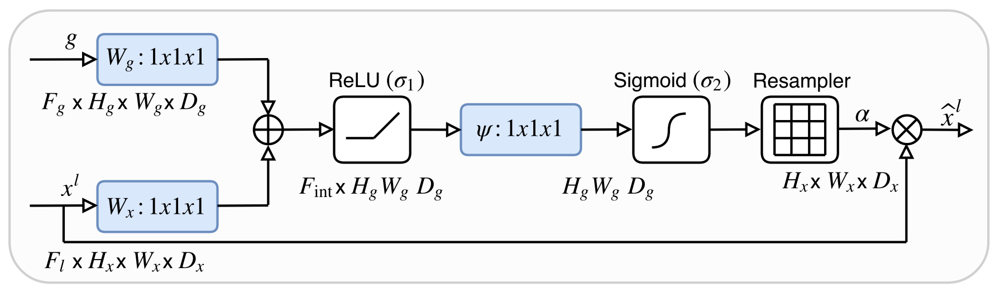
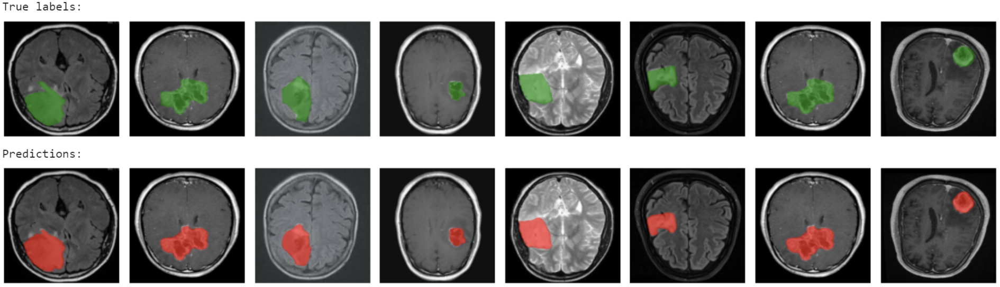

In this notebook I'm going to compare performances of [U-Net](https://arxiv.org/abs/1505.04597) to a small variant called [Attention U-Net](https://arxiv.org/abs/1804.03999) in the task of brain tumor detection.

The dataset I used is from [Kaggle: Br35H::Brain Tumor Detection 2020](https://www.kaggle.com/ahmedhamada0/brain-tumor-detection) and can be found [here](https://drive.google.com/file/d/1RUFF3B_n5PcnitbUGULdPWciPPyCb_1i/view?usp=sharing) (credits to: [AryaKoureshi](https://github.com/AryaKoureshi) for masks extraction).

The attention mechanism is the one describe in below figure:

Results show that the use of this attention mechanism can slightly improve performance:

| Method          | Accuracy   | Dice score | IoU score |
| --------------- | ---------- | ---------- | --------- |
| U-Net           | 97.95%     | 0.81       | 0.68      |
| Attention U-Net | **98.04%** | **0.82**   | **0.70**  |

Looking at the result we get from Attention U-Net on validation set is very promising considering that it has been trained for only 25 epochs:

